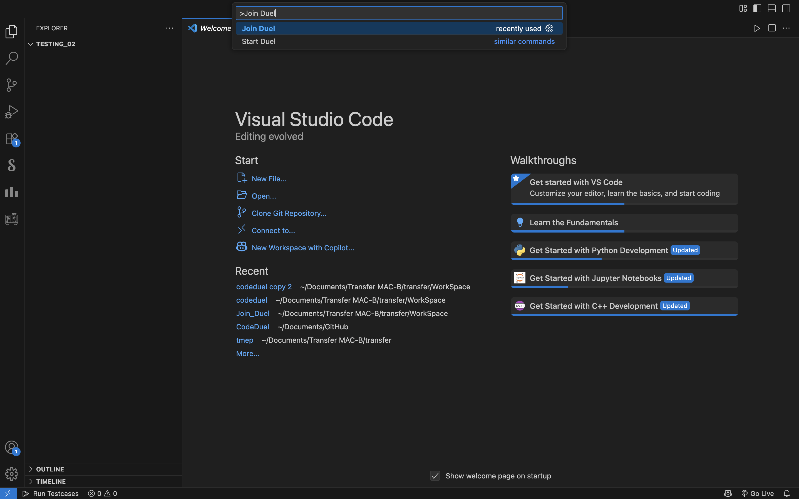

# ⚔️ CodeDuel

**CodeDuel** is a competitive coding VS Code extension that lets two developers go head-to-head by solving the same Codeforces problem in real-time. The one who gets an accepted solution first — wins. It's built to bring the thrill of competitive programming duels directly inside your code editor.

> Compete. Code. Win. All inside VS Code.

---

##  Features

-  Random Codeforces problem generator
-  Real-time room-based duels between two coders
-  Automatic winner detection using Codeforces API
-  Pre-filled test cases for each problem
-  Run test cases directly into VS Code.
-  Clean, minimal UI integrated into VS Code
-  Secure and battle-tested backend hosted on Railway

---

##  Preview

## 🎬 Workflow Demo

Here’s a quick walkthrough of how CodeDuel works inside VS Code:

| Action | Preview |
|--------|---------|
| **Start a Duel** <br>Press F5 and then Press `Cmd+Shift+P` (Mac) / `Ctrl+Shift+P` (Windows) to open the Command Palette. Enter your User ID, then a room ID will be generated. Pass it to your friend. |  |
| **Join a Duel**<br>Use the command Join Duel in command palette |  |
| **Enter Room ID**<br>Enter the room ID to connect. |  |
| **Problem Delivered**<br>Problem statement appears side-by-side with your code editor. |  |
| **Run Sample Test**<br>Check sample input/output inside VS Code only |  |
| **Winner Declaration**<br>One who submits first will win the duel |  |


##  How It Works

> 🛠️ The extension is **not yet published** on the VS Code Marketplace. You’ll need to run it in development mode:

1. Clone this repository.
2. Open the project in **Visual Studio Code**.
3. Press `F5` to launch a **development instance** of VS Code with the extension loaded.
4. In the new window, use the command palette or UI to **start a duel**, share the `roomId` with a friend, and begin!

💡 The backend is already deployed, so you **do not need to run `node server/server.js`** unless you plan to self-host or contribute to server-side changes.

---

##  Installation (for development)

```bash
# Clone the repository
git clone https://github.com/Gourav-byte/CodeDuel

# Install dependencies for the VS Code extension
cd CodeDuel
npm install
